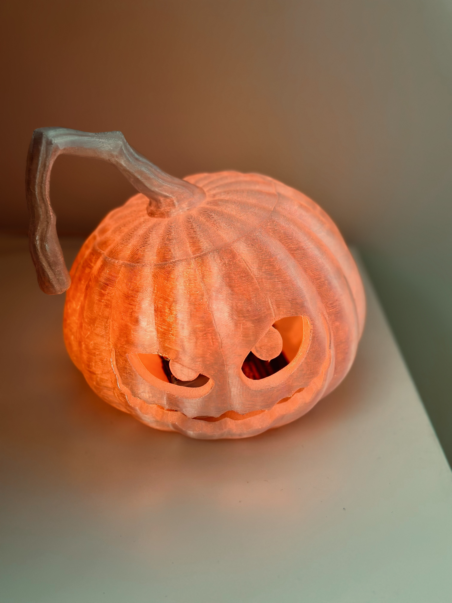

# PumpkinPeek — Interactive 3D Printed Spooky Pumpkin

A motion-activated Halloween prop. A PIR sensor detects passers-by, the onboard NeoPixels flicker orange/red like a candle (random brightness 75–255) and the buzzer plays the opening of the Halloween theme, then cools down and re-arms. Printed in transparent PLA/PETG so the shell glows.

  
  

More photos in [images/](images/).

## Build

| | |
|---|---|
| **Code** | [`code/PumpkinPeek/PumpkinPeek.ino`](code/PumpkinPeek/PumpkinPeek.ino) |
| **3D parts** | [`stl/pumpkin-peek.stl`](stl/pumpkin-peek.stl) |
| **Hardware** | Kypruino, PIR motion sensor, 3× male–female DuPont wires, USB-C cable |
| **Wiring** | PIR VCC → 5V · GND → GND · OUT → D7 |
| **Libraries** | Adafruit NeoPixel |
| **Print** | Transparent filament; flat internal base for board mounting, rear hole for USB-C |
| **Guide** | [Read the full build](https://robo.com.cy/blogs/blog/create-your-own-kypruino-arduino-spooky-3d-printed-pumpkin) |

*Model attribution: based on "Jackie Jack-o-Lantern" by BirdBott on [Thingiverse](https://www.thingiverse.com/thing:4613024), modified with a flat base and cable pass-through.*
