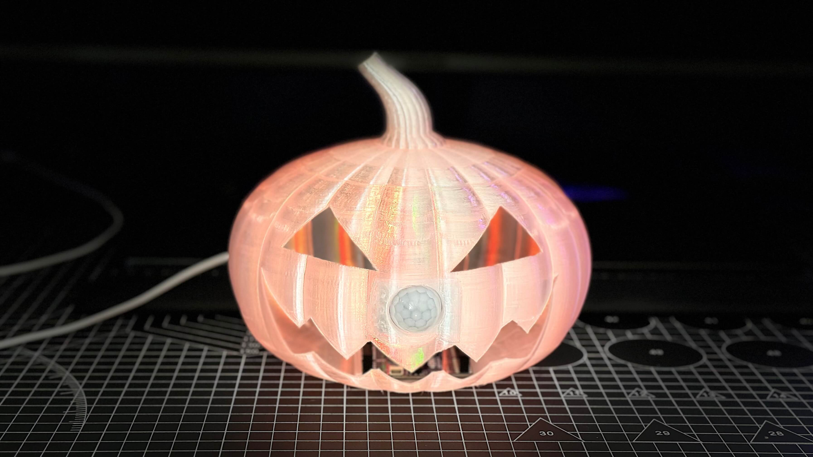
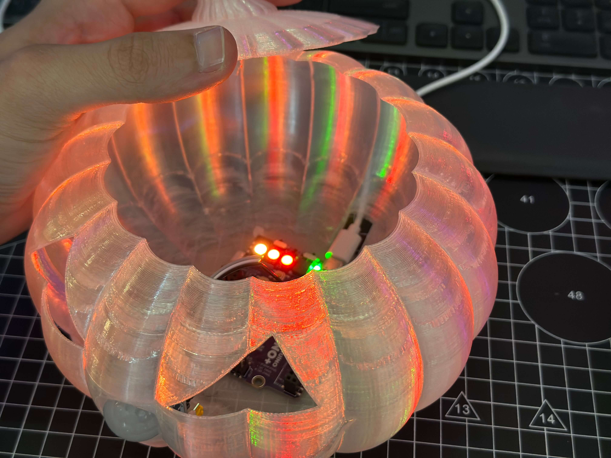

# PumpkinPeek — Interactive 3D Printed Spooky Pumpkin

A motion-activated Halloween prop. A PIR sensor detects passers-by, the onboard NeoPixels flicker orange/red like a candle (random brightness 75–255) and the buzzer plays the opening of the Halloween theme, then cools down and re-arms. Printed in transparent PLA/PETG so the whole ribbed shell glows instead of only the eyes and mouth.

The enclosure is an original ROBO design: a fluted pumpkin body with triangular eyes and a jagged mouth, a lift-off lid with a stem, a dedicated PIR holder at the "nose", a flat internal base with clips for the Kypruino, and a rear opening for the USB-C cable.

  
  

More photos in [images/](images/), including the [wiring diagram](images/pumpkin-peek-wiring.png).

## Build

| | |
|---|---|
| **Code** | [`code/PumpkinPeek/PumpkinPeek.ino`](code/PumpkinPeek/PumpkinPeek.ino) |
| **3D parts** | [`stl/pumpkin-peek.stl`](stl/pumpkin-peek.stl) |
| **Hardware** | Kypruino, PIR motion sensor, 3× male–female DuPont wires, USB-C cable |
| **Wiring** | PIR VCC → 5V · GND → GND · OUT → D7 |
| **Onboard** | NeoPixels → D8 · Buzzer → D9 |
| **Libraries** | Adafruit NeoPixel |
| **Print** | Transparent or translucent PLA/PETG. Body, lid and PIR holder; flat internal base with board clips and a rear USB-C opening. Remove supports and check the lid seats and the cable clears before assembling |
| **Guide** | [Read the full build](https://robo.com.cy/blogs/blog/create-your-own-kypruino-arduino-interactive-3d-printed-spooky-pumpkin-re-written) |

*The pumpkin model is ROBO's own design, released under the repository licences — see the root [README](../README.md#licence).*
