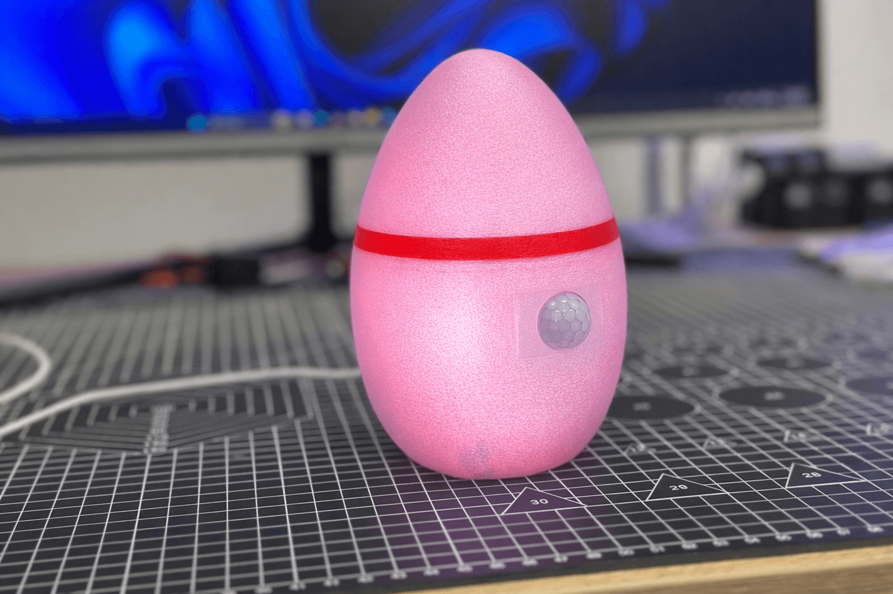
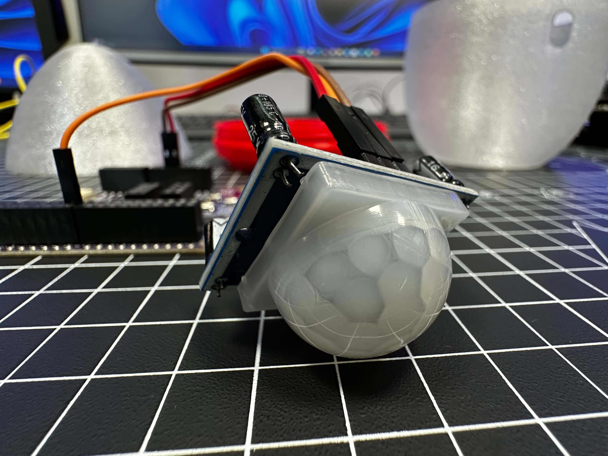

# EggCited — Interactive 3D Printed Easter Egg

An egg that celebrates when it is found. PIR motion detection triggers a quick LED flash, a smooth pastel colour animation and a short reward sound, then resets. Two-part translucent print for easy access to the electronics.

  
  

More photos in [images/](images/).

## Build

| | |
|---|---|
| **Code** | [`code/EggCited/EggCited.ino`](code/EggCited/EggCited.ino) |
| **3D parts** | *STL not yet published — coming soon* |
| **Hardware** | Kypruino, PIR motion sensor, 3× male–female DuPont wires, USB cable |
| **Wiring** | PIR VCC → 5V · GND → GND · OUT → D7 |
| **Libraries** | Adafruit NeoPixel |
| **Print** | Translucent filament, hollow two-part shell, USB opening, stable base |
| **Guide** | [Read the full build](https://robo.com.cy/blogs/blog/create-your-own-interactive-easter-egg-with-kypruino-arduino) |
