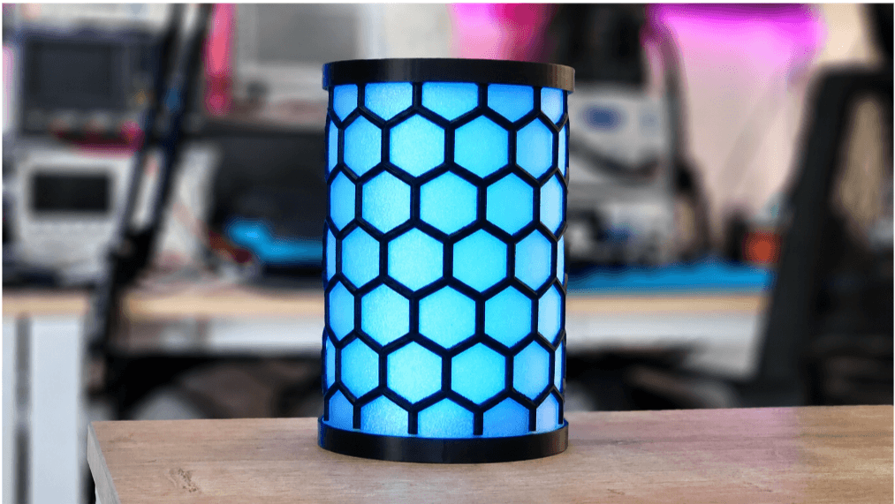
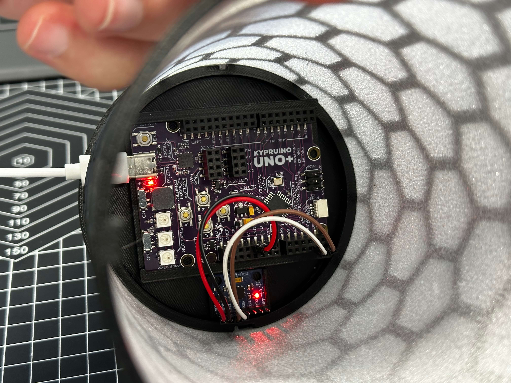

# TiltGlow — MagicMotion DIY Mood Lamp

A gesture-controlled lamp with no buttons or app. Tilt to change brightness, shake to cycle colour, flip upside down to switch off. Colours cross-fade smoothly and each has its own idle animation. Startup calibration records a reference gravity vector.

  
  

More photos in [images/](images/).

## Build

| | |
|---|---|
| **Code** | [`code/TiltGlow/TiltGlow.ino`](code/TiltGlow/TiltGlow.ino) |
| **3D parts** | [`stl/tilt-glow.stl`](stl/tilt-glow.stl) |
| **Hardware** | Kypruino, MPU6050 accelerometer/gyro, NeoPixel ring or onboard NeoPixels, USB cable |
| **Wiring** | MPU6050 SDA → A4 · SCL → A5 · VCC → 5V · GND → GND · NeoPixel DIN → D8 |
| **Libraries** | Adafruit NeoPixel, MPU6050 (I2C) |
| **Print** | Cylindrical multi-part enclosure, fuzzy-skin outer shell for light diffusion, USB opening |
| **Guide** | [Read the full build](https://robo.com.cy/blogs/blog/magicmotion-diy-mood-lamp-kypruino-neopixel) |
