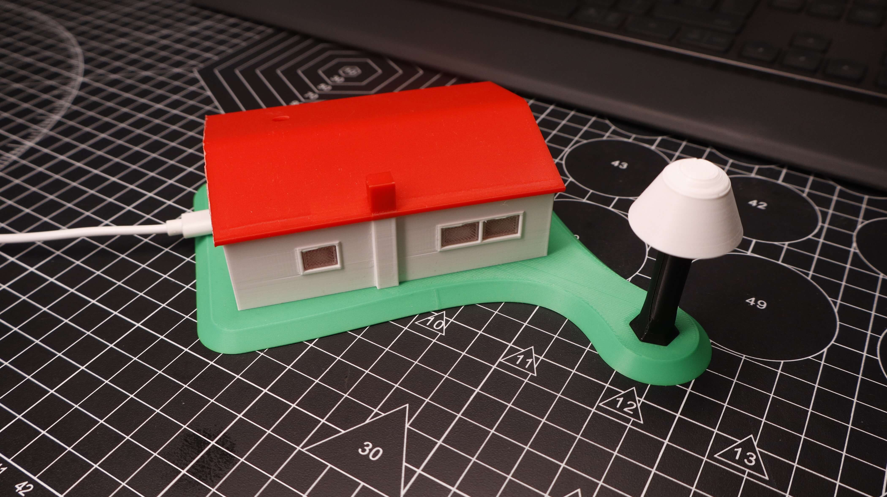
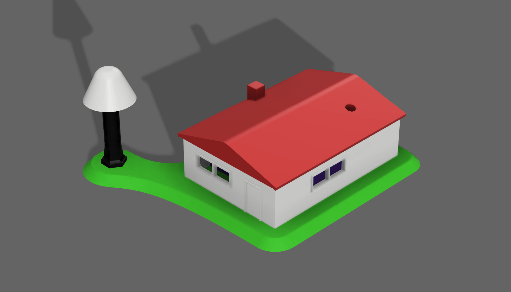

# StarSaver — Smart Street Light Model for Dark Skies

A planetarium demonstration model for light-pollution awareness, built for DarkSky Week and used by the DarkSky Cyprus Chapter to demonstrate "a home under the stars". An LDR module on the roof reads ambient light; below a threshold the model switches on a downward-facing warm white street lamp while the onboard NeoPixels light the house interior with a dim warm glow. Lamp wiring is routed underground into the house for a clean presentation.

  
  

More photos in [images/](images/).

## Build

| | |
|---|---|
| **Code** | [`code/StarSaver/StarSaver.ino`](code/StarSaver/StarSaver.ino) |
| **3D parts** | [`stl/star-saver.stl`](stl/star-saver.stl) |
| **Hardware** | Kypruino, LDR light sensor module, warm white LED + series resistor, USB cable |
| **Wiring** | LDR VCC → 5V · GND → GND · SIG → A0 · LED anode → D10 via resistor · cathode → GND |
| **Libraries** | Adafruit NeoPixel |
| **Print** | House enclosure (roof slot for LDR), street lamp, base section with underground wire channel |
| **Config** | `darkThreshold = 500`, `LAMP_BRIGHTNESS`, `HOUSE_R/G/B` |
| **Tuning** | Watch the live LDR value in the Serial Monitor at 9600 baud, then set `darkThreshold` between your lit and dark readings. If the lamp behaves backwards, flip the `<` comparison in `loop()` |
| **Guide** | [Read the full build](https://robo.com.cy/blogs/blog/smart-street-light-model-dark-skies-kypruino) |
