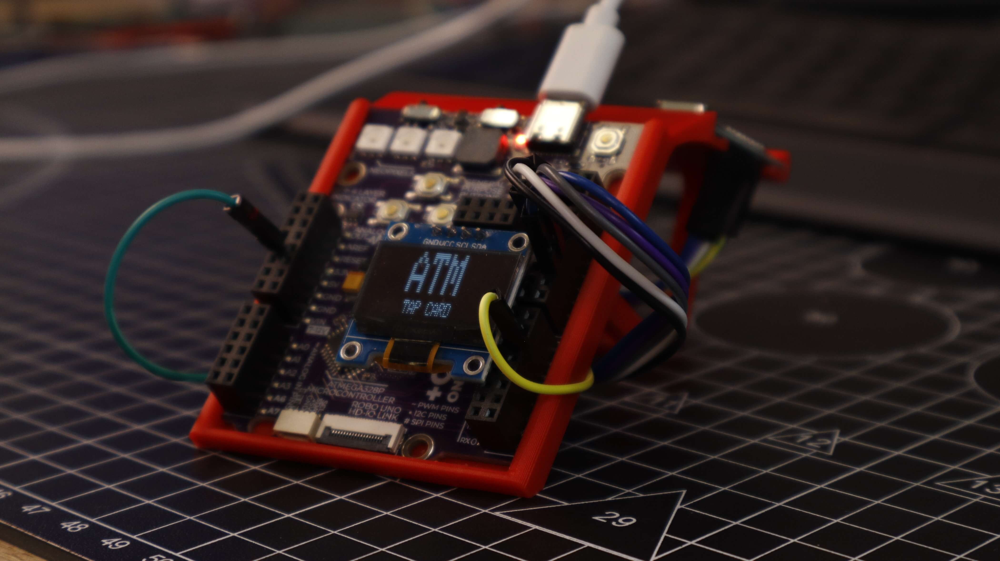
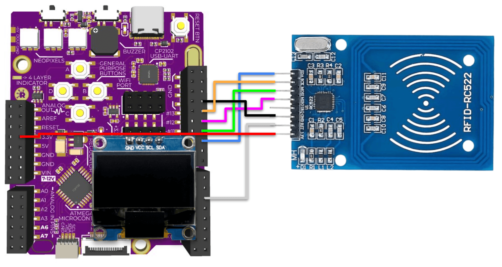

# TapVault — Kypruino Mini Banking System

A simulated card-based banking terminal. Tap an RFID card to open an account, then deposit, withdraw or transfer virtual money to a second card. Balances are stored in EEPROM as cents so they survive power loss. Onboard buttons drive the menu and digit editor; NeoPixels and buzzer give accept/decline feedback.

> ⚠️ Educational simulation only. No connection to real banks or payment networks. Do not use real bank cards.

  
  

More photos in [images/](images/).

## Build

| | |
|---|---|
| **Code** | [`code/TapVault/TapVault.ino`](code/TapVault/TapVault.ino) |
| **3D parts** | [`stl/tap-vault.stl`](stl/tap-vault.stl) |
| **Hardware** | Kypruino, RC522 RFID reader, 128×32 SSD1306 I2C OLED, 13.56 MHz MIFARE-style cards/tags, USB-C cable |
| **Wiring** | RC522 SDA → D10 · SCK → D13 · MOSI → D11 · MISO → D12 · RST → D5 · **3.3V (not 5V)** · GND → GND OLED → dedicated I2C port (VCC/GND/SDA/SCL) |
| **Onboard** | Buttons A/B/C/D → D7/D6/D4/D2 · NeoPixels → D8 · Buzzer → D9 |
| **Libraries** | MFRC522, Adafruit SSD1306, Adafruit GFX, Adafruit NeoPixel, Adafruit BusIO (SPI/Wire/EEPROM built in) |
| **Config** | `accountNames[]`, `STARTING_BALANCE_CENTS`, `RESET_ALL_ACCOUNTS` |
| **Print** | Optional terminal-style enclosure |
| **Guide** | [Read the full build](https://robo.com.cy/blogs/blog/kypruino-mini-nfc-banking-terminal) |
