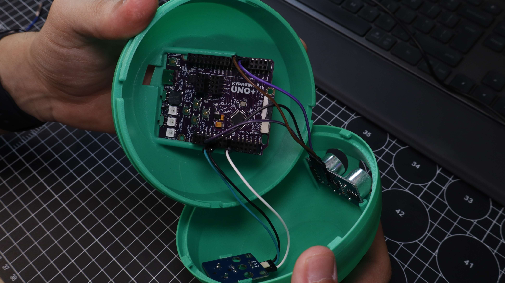
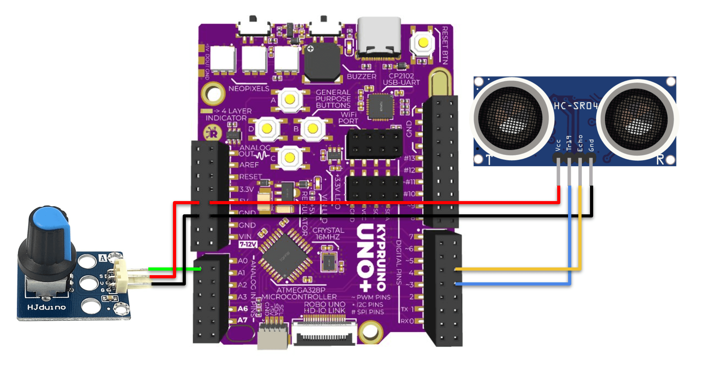

# SonicSphere — Kypruino Mini Theremin

A gesture-played instrument in a spherical shell. Hand distance from an ultrasonic sensor maps to chromatic notes from C4 to C6, with stability filtering so notes do not jump. A potentiometer sets vibrato depth. Sound comes from the onboard buzzer via `tone()`.

  
  

More photos in [images/](images/).

## Build

| | |
|---|---|
| **Code** | [`code/SonicSphere/SonicSphere.ino`](code/SonicSphere/SonicSphere.ino) |
| **3D parts** | [`stl/sonic-sphere.stl`](stl/sonic-sphere.stl) |
| **Hardware** | Kypruino, HC-SR04 ultrasonic sensor, potentiometer, USB-C cable |
| **Wiring** | HC-SR04 VCC → 5V · GND → GND · TRIG → D4 · ECHO → D5 Pot S → A0 · V → 5V · G → GND · Buzzer → D9 (onboard) |
| **Libraries** | None — standard Arduino + `math.h` |
| **Config** | `CLOSE_IS_HIGH`, `MIN_DISTANCE_CM = 5.0`, `MAX_DISTANCE_CM = 50.0` |
| **Print** | Two-half spherical enclosure with front sensor openings, pot slot and internal board supports |
| **Guide** | [Read the full build](https://robo.com.cy/blogs/blog/kypruino-mini-theremin-ultrasonic-musical-instrument) |
