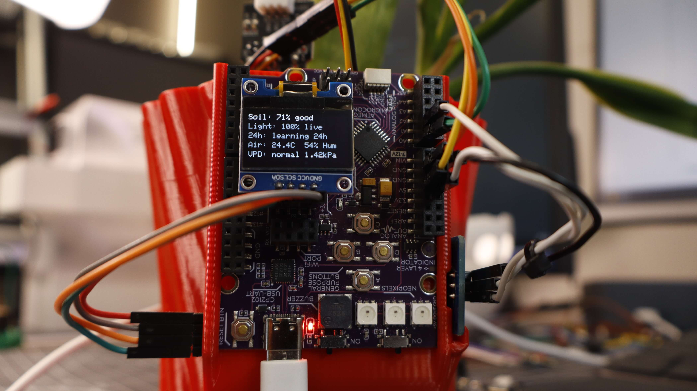
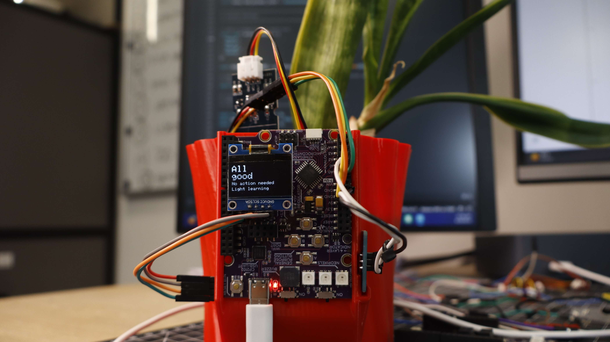

# PlantPal — Smart Plant Monitor

A plant pot that tells you how the plant feels. Reads soil moisture, ambient light, temperature and humidity, derives VPD (vapour pressure deficit) and a weighted comfort score, then cycles three OLED screens: an animated mood face, live sensor values and a suggested action. Ambient light is judged on a rolling 24-hour average so it does not complain every night.

  
  

More photos in [images/](images/).

## Build

| | |
|---|---|
| **Code** | [`code/PlantPal/PlantPal.ino`](code/PlantPal/PlantPal.ino) |
| **3D parts** | [`stl/plant-pal.stl`](stl/plant-pal.stl) |
| **Hardware** | Kypruino, 0.96" SSD1306 128×64 I2C OLED, capacitive soil moisture sensor, analog light sensor module, AHT10 temp/humidity sensor, USB-C cable |
| **Wiring** | OLED + AHT10 → shared I2C (VCC/GND/SDA/SCL) · Soil AOUT → A0 · Light AO → A1 (DO unused) |
| **Libraries** | Adafruit SSD1306, Adafruit GFX, Adafruit AHTX0, Adafruit BusIO |
| **Config** | Uncomment one care profile: `PROFILE_DRY_LOVING`, `PROFILE_BRIGHT_HERB`, `PROFILE_BALANCED_HOUSEPLANT`, `PROFILE_FLOWERING`, `PROFILE_HUMID_LOVING`, `PROFILE_ORCHID_AIRY`, `PROFILE_CUSTOM` |
| **Print** | Pot with a flat side for external board/OLED mounting, plus slots for the light and AHT10 sensors |
| **Guide** | [Read the full build](https://robo.com.cy/blogs/blog/smart-plant-monitor-kypruino-oled) |
