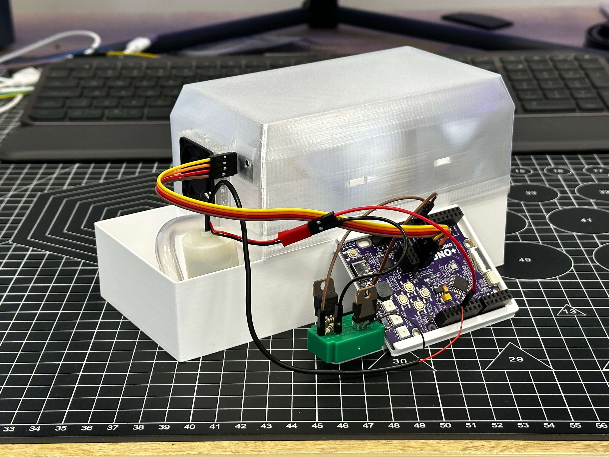
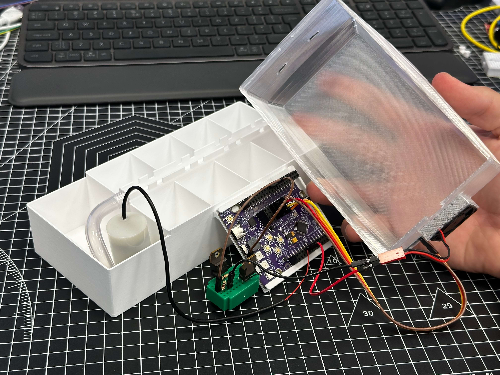

# Smart Mini Greenhouse

A desktop greenhouse that waters and ventilates itself. A DHT22 sensor checks temperature and air humidity every five minutes: if humidity drops too low, a small pump briefly fills the internal water channel; if it gets too hot or too humid, a fan switches on for ventilation (with hysteresis so it does not chatter). No soil moisture sensor needed.

  
  

More photos in [images/](images/).

## Build

| | |
|---|---|
| **Code** | [`code/MiniGreenhouse/MiniGreenhouse.ino`](code/MiniGreenhouse/MiniGreenhouse.ino) |
| **3D parts** | [`stl/mini-greenhouse.stl`](stl/mini-greenhouse.stl) |
| **Hardware** | Kypruino, DHT22 (or DHT11) temp/humidity sensor, small water pump + driver, fan + driver, USB cable |
| **Wiring** | DHT data → D2 · Pump driver → D8 · Fan driver → D9. **Do not power the pump or fan directly from Kypruino I/O pins — use driver modules/transistors.** |
| **Libraries** | DHT sensor library |
| **Config** | `DHT_TYPE`, `HUMIDITY_WATER_THRESHOLD = 55.0`, `TEMP_FAN_ON/OFF`, `HUMIDITY_FAN_ON/OFF`, `CHECK_INTERVAL_MS`, `PUMP_TIME_MS` |
| **Print** | Greenhouse enclosure with internal water channel |
| **Guide** | [Read the full build](https://robo.com.cy/blogs/blog/kypruino-mini-smart-greenhouse) |
